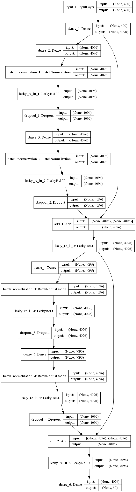

# DL_in_LR
## 本科毕业设计
利用 NIST 2015 语言识别 i-Vector 机器学习挑战提供的数据集，基 于 Keras 神经网络库开发训练神经元网络模型，期望在语言识别过程 中能够获得较好的成绩。尝试通过调节不同的内部隐藏神经元的数 量、调节不同的训练轮数、使用不同的优化器、调节优化器学习率、 调节批处理的大小、添加 Dropout 层降低过拟合现象来优化网络， 此外还尝试运用了目前最新的 ResNet 网络结构来获得更好的结果。 调节各项参数的过程将由折线图形象的展现。最终在测试集数据上的 预测结果达到了 85.3%的正确率。
### 网络模型概图如下

___
### 残差网络模型概图

### （使用前将mine/tsv/ivec15_lre_train_ivectors.zip解压）
